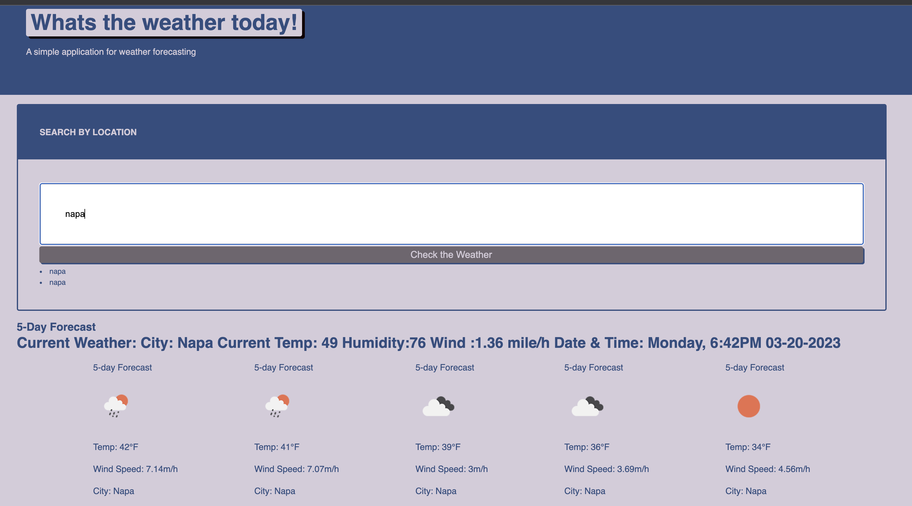

# Weather Application
The assigment is to create a weather app using API for the data
starting from scratch with no startercode, html has been created and css have been borrowed from previous code

## Progress
Copied the REPO and cloned. 
created the files needed, must build out the bones of html at least 
using jquery to target id and add the current date.
have a search bar, with input that will display the city in console log (where i am stuck) - x
must show current conditiona nd future 5 day forecast
when looking at current weather these values should display city name, {the date, an icon representation of weather conditions, the temperature - X, the humidity - X, and the wind speed}
list of cities and different cells for when info is added
must add a search history button that will desplay the past weatehr search
was able to complete the assigment using elemts from prior classes like the dayjs function, and using bootstrap to style the app. 

### Lessons 
Learned how to pull data from an API
learned how to create fetch requests and how to have that data display dynamicly
learned more about how to use bootstrap

### Links and Screenshots
Github: https://github.com/escotoj/WeatherApp 
Deployed App: https://escotoj.github.io/WeatherApp/ 

