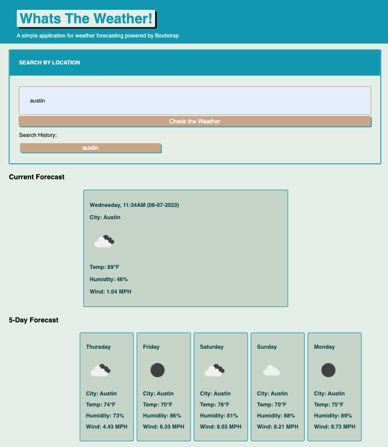

# Weather Application

## Description

Weather application using thrid-party API (WeatherAPI) using Bootstrap for a responsive application. Upon entering a city, the data is then fetch thourgh the API to ultimatly render the weather data dynamicly.

[Click here to view deployed app](https://escotoj.github.io/WeatherApp/)

## Table of Contents

- [Credits](#Credits)
- [License](#License)
- [Links](#Links)

## Credits

Jose Escoto, Full Stack Development Student, University of Berkeley.

## License

License: MIT License

## Links

Github: https://github.com/escotoj/WeatherApp
Deployed App: https://escotoj.github.io/WeatherApp/

